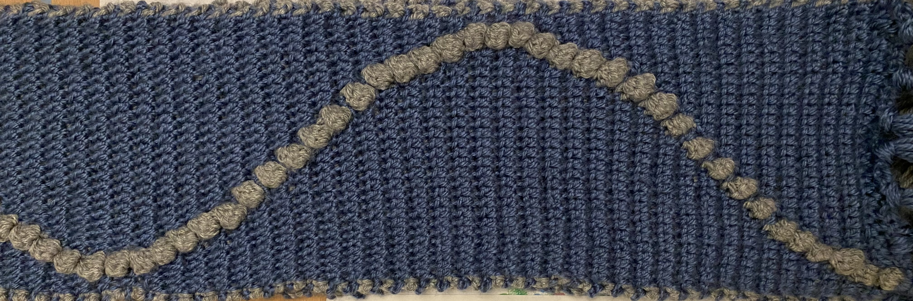

# CrochetMath Studio

**Turn equations into crochet patterns you can actually make.**

Pick a function, tweak your grid and yarn colors, and export row-by-row stitch instructions you can take straight to your needles.

🔗 **[Live app →](https://ciahan.github.io/CrochetMath-Studio/)**

---


*The scarf that started this project. My math teacher measured the wave with a ruler. It was exact. He kept it — it's still in his desk drawer.*

---

## What inspired this

My math teacher gave us two hours to express a mathematical concept through art. Most students drew graphs or made posters. I decided to crochet the sine function.

I had never designed a crochet pattern before. I spent the night teaching myself how to map `sin(x)` to stitch positions — working out the coordinate transformation, the column mapping, the row-by-row logic. I finished at dawn.

When I handed it in, my teacher pulled out a ruler and measured the wave.

It was exact. He kept it — it's still in his desk drawer.

That night is why I built CrochetMath Studio — so anyone can do in seconds what took me all night to figure out. And it's why I know that for me, math, code, and making things with my hands aren't three different interests. They're the same thought, expressed three different ways.

## Features

**Function mode** — 24 built-in functions (sine, triangle, chirp, damped, harmonic, rose, spiral, heart, and more), each mapped to a column position per row to generate a wave-like stitch pattern.

**Custom equations** — write your own `f(x)` using `sin`, `cos`, `tan`, `abs`, `sqrt`, `pow`, `PI`, `E`, and more. Renders live as you type, auto-scaled to fit the grid.

**Shape mode** — 12 pixel-grid shapes (heart, star, butterfly, tree, crown, and others) for patterns that aren't wave-based.

**Image mode** — upload a photo (pets are the sweet spot) and convert it into a filet crochet block/mesh grid via dithering or a hard threshold, with an Invert option for light-on-dark photos. An optional AI background-removal step (DeepLab v3, loaded on demand) detects cats, dogs, and people in the photo and clears everything else, so the couch or the lawn behind them doesn't end up in the pattern.

**Mirror & Repeat** — reflect a pattern across its center line or tile it across the width for more complex, symmetric designs. Works in Function mode.

**Gallery** — 51 curated presets combining functions, mirroring, and repeats, ready to load with one click.

**Color palette** — 12 built-in palettes plus custom hex input for the "on"/"off" stitch colors.

**Yarn gauge calculator** — enter your swatch gauge and desired finished size, and it works out exactly how many rows and columns to use, with an optional yardage estimate. One click applies the numbers straight to the grid-size sliders.

**Export**
- Download the pattern as a PNG
- Export a printable PDF stitch sheet with row-by-row instructions (e.g. *"Row 1: 14 off, 1 ON, 15 off"*) — works for Function, Shape, and Image patterns alike
- Copy a shareable link that encodes the exact pattern configuration (Function mode only — Shape and Image patterns can't be compactly URL-encoded)
- Save a pattern to a personal gallery stored in your browser (most reliable for Function mode; Shape and Image patterns don't fully round-trip yet — see [Known limitations](#known-limitations))

**Undo / redo** — full history of grid size, colors, function, and options, with `Ctrl+Z` / `Ctrl+Shift+Z` shortcuts.

**Animation mode** — watch the pattern draw itself row by row, at an adjustable speed.

**Installable app** — CrochetMath Studio is a Progressive Web App. Add it to your home screen on mobile or desktop for an app-like, offline-friendly experience.

**Dark mode**, and a layout that adapts down to mobile screens.

## How it works

### Function mode

For each row `i`, the app computes:

```
x   = (i / rows) × 2π
y   = f(x)                              ← the chosen function, output clamped to [−1, 1]
col = round((y + 1) / 2 × (segW − 1))  ← map to a column index within the active segment
```

That column gets the "on" color; every other stitch in the row gets the "off" color. Repeating this down every row traces the function's shape into the grid, one stitch at a time.

**Repeat** divides the grid into 3 equal segments (`segW = cols / 3`) and scales the wave to fit each one directly, so every copy is a clean, identically-shaped repetition — not a distorted fragment of a wider wave.

**Mirror** reflects the column position across the center of its segment (`cols − 1 − col`) and draws both the original and its mirror image, producing a true left-right symmetric pattern rather than folding the wave's values before placing it.

### Shape and Image mode

Both of these are really the same idea underneath: a full 2D grid of "on"/"off" cells, rather than one stitch per row.

- **Shape mode** starts from a small fixed pixel grid (e.g. a 10×10 heart) and scales it up to fit your current row/column count via nearest-neighbor sampling.
- **Image mode** resamples your uploaded photo directly to the current rows × columns, converts it to grayscale, and then either:
  - applies **Floyd–Steinberg dithering** — spreading each pixel's rounding error to its neighbors, so gradients and detail come through as a smooth pattern of stitches rather than a flat blob, or
  - applies a **hard threshold** — every pixel darker than the cutoff becomes a stitch, everything lighter doesn't.

  If **Remove background** is on, the photo is first run through a DeepLab v3 semantic segmentation model (right in your browser) that identifies cat/dog/person pixels; everything else is painted white before dithering, so it drops out of the pattern as empty mesh.

### Stitch instructions, generalized

Whatever mode produced the pattern, the row-by-row instructions are built the same way: each row is run-length encoded into alternating "off"/"ON" runs (e.g. *"Row 12: 4 off, 6 ON, 3 off, 9 ON, 8 off"*), so a shape's two-sided silhouette or an image's scattered blocks are described just as precisely as a simple wave's single stitch run.

### A few of the functions

| Function | Formula | Character |
|---|---|---|
| Sine wave | `sin(x)` | Smooth S-curve — the one from the scarf |
| Cosine | `cos(x)` | Same wave, starts at the peak |
| Heart | `2·sin(u)·\|cos(u)\|` | Pinches into a heart silhouette (mirrored) |
| Rose | `cos(2x)` | Zigzags four times per cycle |
| Spiral | `sin(3x) · (row/rows)` | Starts narrow, fans out |
| Chirp | `sin(x² / π)` | Frequency increases down the pattern |

...plus 18 more in the Function panel, from damped and harmonic waves to interference patterns and shark-fin curves.

## Tech stack

No frameworks, no build step, and no required dependencies. Just:

- **HTML5 Canvas** for pattern rendering
- **Vanilla JavaScript** for all logic (pattern math, UI state, PDF/PNG export)
- **CSS** for layout and theming
- A small **service worker** + **web manifest** for PWA/offline support

The entire app runs client-side — nothing is sent to a server, and every pattern you generate stays on your device unless you explicitly export or share it.

The one exception: **Image mode's "Remove background" toggle** lazily loads [TensorFlow.js](https://www.tensorflow.org/js) and a pre-trained DeepLab v3 segmentation model from a CDN, entirely on-demand — nothing downloads unless you actually click that toggle.

## Project structure

```
CrochetMath-Studio/
├── index.html        # Markup and page structure
├── styles.css         # All styling
├── app.js              # Pattern math, rendering, and UI logic
├── manifest.json    # PWA manifest (name, icons, theme colors)
├── sw.js                 # Service worker for offline support
├── icon-192.png        # App icon (small)
├── icon-512.png        # App icon (large)
├── og-image.png       # Social share preview image
└── scarf.jpeg           # The original scarf photo
```

Since it's a static site with no build step, you can open `index.html` directly in a browser, or serve the folder with any static file server.

## Running locally

```bash
git clone https://github.com/ciahan/CrochetMath-Studio.git
cd CrochetMath-Studio
python3 -m http.server 8000
# then open http://localhost:8000
```

(A local server is only needed for the service worker to register correctly — opening `index.html` directly still works for everything else.)

## Known limitations

- **Shareable links only encode Function mode.** Shape and Image patterns depend on either a fixed built-in grid or your own uploaded photo, neither of which fits cleanly into a URL.
- **Save-to-gallery doesn't fully round-trip Shape or Image patterns yet.** It's reliable for Function mode; saved Shape and Image patterns can lose their thumbnail accuracy or, for Image mode, the source photo itself (which isn't persisted). This is on the list to fix properly.
- **Background removal only recognizes cats, dogs, and people** (the DeepLab v3 PASCAL classes most relevant here) — other pets or objects won't be separated from their background yet.

## Future improvements

- Fix Save-to-gallery so Shape and Image patterns round-trip correctly
- More functions (Fourier series, Perlin noise, parametric curves)
- Multi-color patterns (more than one "on" stitch per row)
- Broader background-removal support beyond cats, dogs, and people

## Contributing

Found a bug, or have an idea for a new function or shape? Open an issue or a pull request. Since it's a single-file-per-concern static app, most changes only touch `app.js` (logic) or `styles.css` (appearance).

## License

All rights reserved. This project is shared publicly for viewing and portfolio purposes, but the code may not be copied, modified, or redistributed elsewhere without permission. (Contributing a pull request back to this repo is welcome and different from that — see the Contributing section above.)

## About

Built by Ciara Feng — a high school student in the STEM program at Montgomery Blair, where math, making, and code turned out to be the same thing.

The sine scarf lived as a physical object long before it became software. CrochetMath Studio is the attempt to close that loop: to make the math visible, holdable, and shareable.
