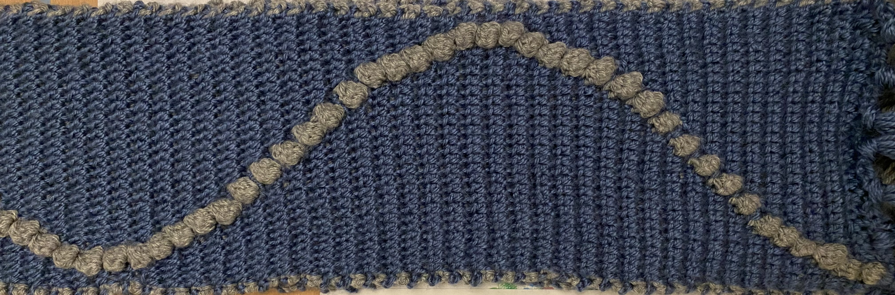

# CrochetMath Studio

**Visualizing Mathematics Through Fiber Art**

A web app that transforms mathematical functions into crochet-ready grid patterns. Pick a function, adjust your grid and yarn colors, watch the pattern animate stitch by stitch, then export row-by-row instructions you can take directly to your needles.

**[Live demo](https://yourusername.github.io/crochetmath)**

---


*The sine wave scarf that started this project. My math teacher measured the wave. It was exact. He kept it.*

---

## What inspired this

My math teacher gave us two hours to express a mathematical concept through art. Most students drew graphs or made posters. I decided to crochet the sine function.

I had never designed a crochet pattern before. I spent the night teaching myself how to map sin(x) to stitch positions — working out the coordinate transformation, the column mapping, the row-by-row logic. I finished at dawn.

When I handed it in, my teacher pulled out a ruler. She measured the wave.

It was exact.

She kept it. It's still in her desk drawer.

That night is why I built CrochetMath Studio — so anyone can do in seconds what took me all night to figure out. And it's why I know that for me, math, code, and making things with my hands are not three different interests. They're the same thought, expressed three different ways.

---

## Features

- **6 mathematical functions** — sine, cosine, heart curve, rose curve, spiral, and Lissajous figure
- **Live controls** — rows, columns, and two yarn colors update the pattern instantly
- **Row-by-row animation** — watch the pattern build stitch by stitch in real time
- **Stitch-by-stitch export** — generates crochet instructions for every row (e.g. "Row 1: 14 off, 1 ON, 15 off")
- **Shareable URL** — every setting is encoded in the URL so you can share any pattern with a link
- **Download PNG** — export the grid as an image file

---

## How it works

For each row `i`, the app computes:

```
x   = (i / rows) × 2π
y   = f(x)                              ← the chosen function, output ∈ [−1, 1]
col = round((y + 1) / 2 × (cols − 1))  ← map to a column index
```

That column gets the "on" color. Every other stitch gets the "off" color.

### The functions

| Function | Formula | Character |
|---|---|---|
| Sine wave | `sin(x)` | Smooth S-curve — the one from the scarf |
| Cosine | `cos(x)` | Same wave, starts at the peak |
| Heart curve | `sin(u)·\|cos(u)\|` | Pinches at top and bottom |
| Rose curve | `cos(2x)` | Zigzags four times per cycle |
| Spiral | `sin(3x) · (row/rows)` | Starts narrow, fans out |
| Lissajous | `sin(3x + π/4)` | Phase-offset asymmetric wave |

---

## Tech stack

- Plain HTML, CSS, and JavaScript — no frameworks, no dependencies, no build step
- Canvas API for rendering
- `URLSearchParams` for shareable links
- Deployed on GitHub Pages

---

## Running locally

No install required:

```bash
git clone https://github.com/yourusername/crochetmath
open crochetmath/index.html
```

---

## Screenshots

*Add screenshots here after deploying — drag images into the repo and reference them.*

---

## Future improvements

- More functions (Fourier series, Perlin noise, parametric curves)
- Multi-color patterns (more than one "on" stitch per row)
- Export as PDF with full stitch count sheet
- Photo mode — upload a pet photo and generate a pixel-art crochet pattern

---

## About

Built by Ciara F — mathematician, crocheter, and computer science student.

The sine scarf lived as a physical object long before it became software. CrochetMath Studio is the attempt to close that loop: to make the math visible, holdable, and shareable.
