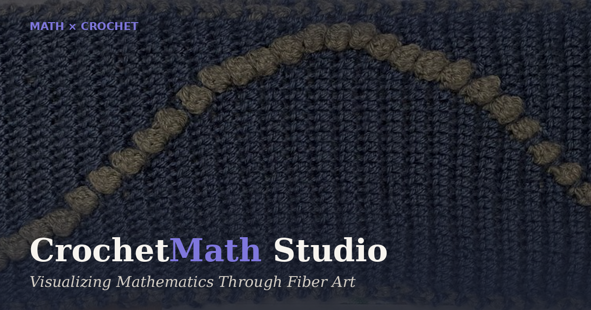

# CrochetMath Studio

**Visualizing Mathematics Through Fiber Art**

A web app that transforms mathematical functions into crochet-ready grid patterns. Pick a function, adjust your grid and yarn colors, watch the pattern animate stitch by stitch, then export row-by-row instructions you can take directly to your needles.


🔗 **[Live app →](https://ciahan.github.io/CrochetMath-Studio/)**



---

## What inspired this

My math teacher gave us two hours to express a mathematical concept through art. Most students drew graphs or made posters. I decided to crochet the sine function.

I had never designed a crochet pattern before. I spent the night teaching myself how to map sin(x) to stitch positions — working out the coordinate transformation, the column mapping, the row-by-row logic. I finished at dawn.

When I handed it in, my teacher pulled out a ruler. He measured the wave.

It was exact.

He kept it. It's still in his desk drawer.

That night is why I built CrochetMath Studio — so anyone can do in seconds what took me all night to figure out. And it's why I know that for me, math, code, and making things with my hands are not three different interests. They're the same thought, expressed three different ways.

## Features

**Function mode** — 24 built-in functions (sine, triangle, chirp, damped, harmonic, rose, spiral, heart, and more), each mapped to a column position per row to generate a wave-like stitch pattern.

**Custom equations** — write your own `f(x)` using `sin`, `cos`, `tan`, `abs`, `sqrt`, `pow`, `PI`, `E`, and more. Renders live as you type, auto-scaled to fit the grid.

**Shape mode** — 12 pixel-grid shapes (heart, star, butterfly, tree, crown, and others) for patterns that aren't wave-based.

**Mirror & Repeat** — reflect a pattern across its center line or tile it across the width for more complex, symmetric designs.

**Gallery** — 51 curated presets combining functions, mirroring, and repeats, ready to load with one click.

**Color palette** — 12 built-in palettes plus custom hex input for the "on"/"off" stitch colors.

**Export & share**
- Download the pattern as a PNG
- Export a printable PDF stitch sheet with row-by-row instructions
- Copy a shareable link that encodes the exact pattern configuration
- Save patterns to a personal gallery (stored locally in your browser)

**Undo / redo** — full history of grid size, colors, function, and options, with `Ctrl+Z` / `Ctrl+Shift+Z` shortcuts.

**Animation mode** — watch the pattern draw itself row by row, at an adjustable speed.

**Installable app** — CrochetMath Studio is a Progressive Web App. Add it to your home screen on mobile or desktop for an app-like, offline-friendly experience.

**Dark mode**, and a layout that adapts down to mobile screens.

## Tech stack

No frameworks, no build step, no dependencies. Just:

- **HTML5 Canvas** for pattern rendering
- **Vanilla JavaScript** for all logic (pattern math, UI state, PDF/PNG export)
- **CSS** for layout and theming
- A small **service worker** + **web manifest** for PWA/offline support

The entire app runs client-side — nothing is sent to a server, and every pattern you generate stays on your device unless you explicitly export or share it.

## Project structure

```
CrochetMath-Studio/
├── index.html        # Markup and page structure
├── styles.css         # All styling
├── app.js              # Pattern math, rendering, and UI logic
├── manifest.json    # PWA manifest (name, icons, theme colors)
├── sw.js                 # Service worker for offline support
├── icon-192.png        # App icon (small)
├── icon-512.png        # App icon (large)
└── og-image.png       # Social share preview image
```

Since it's a static site with no build step, you can open `index.html` directly in a browser, or serve the folder with any static file server.

## Running locally

```bash
git clone https://github.com/ciahan/CrochetMath-Studio.git
cd CrochetMath-Studio
python3 -m http.server 8000
# then open http://localhost:8000
```

(A local server is only needed for the service worker to register correctly — opening `index.html` directly still works for everything else.)

## How the math works

Each function `f(x)` is sampled once per row, mapping the pattern's height (rows) onto one full domain sweep of the function. The resulting value — normalized to `[-1, 1]` — is converted into a column position, and that stitch is marked "on" for that row. Repeating this down every row traces the function's shape into the grid, one stitch at a time.

Mirror mode reflects that column across the grid's center, and Repeat mode tiles the pattern horizontally — both without altering the underlying math, just how it's projected onto the fabric.

## Contributing

Found a bug, or have an idea for a new function or shape? Open an issue or a pull request. Since it's a single-file-per-concern static app, most changes only touch `app.js` (logic) or `styles.css` (appearance).

## License

MIT — see [LICENSE](LICENSE) for details.

## Credits

Built by [Ciahan](https://github.com/ciahan), starting from one very literal interpretation of a math homework assignment.
